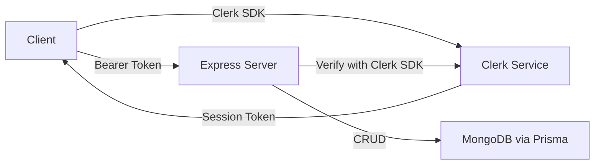

# CricScore — Low-Level Design (Part 1)

> **Scope:** Authentication, Profile, Teams, Guest Players, Live Scoring, Match Summary, Stats & Analytics

---

## 1. Authentication — Clerk Migration

### Current State
Firebase Auth (email/password + Google OAuth) + custom JWT on backend.

### Target State
Migrate to **Clerk** for all auth. Clerk provides: email OTP, phone OTP, Google/social OAuth, session management, user metadata, pre-built UI components.

### Architecture



### Schema Changes

```prisma
model User {
  id              String   @id @default(auto()) @map("_id") @db.ObjectId
  clerkId         String   @unique   // NEW: replaces Firebase UID
  email           String   @unique
  phoneNumber     String?  @unique   // NEW: for phone auth
  // ... rest unchanged
}
```

### Sign-Up Flow (Email OTP)
1. User enters email → Clerk sends 6-digit OTP
2. User enters OTP → Clerk verifies → session created
3. User sets password (optional, Clerk manages)
4. Redirect to profile setup wizard
5. Backend: Clerk webhook `user.created` → create User record in MongoDB

### Sign-Up Flow (Phone)
1. User enters phone number → Clerk sends SMS OTP
2. Enter OTP → verified → session created
3. Redirect to profile setup wizard

### Login Flow
1. Email + password OR Email OTP OR Phone OTP OR Google OAuth
2. Clerk session → `useAuth()` hook → Bearer token to API
3. Backend middleware: `clerkClient.verifyToken(token)` → extract `clerkId` → find User

### Backend Middleware Change

```typescript
// BEFORE (Firebase JWT)
function authenticateToken(req, res, next) {
  const token = req.headers.authorization?.split(' ')[1];
  jwt.verify(token, JWT_SECRET, (err, decoded) => { ... });
}

// AFTER (Clerk)
import { ClerkExpressRequireAuth } from '@clerk/express';
app.use('/api', ClerkExpressRequireAuth());
// req.auth.userId = Clerk user ID → lookup in DB
```

### Files to Change
| File | Change |
|------|--------|
| `client/src/components/auth/auth-context.tsx` | Replace Firebase with Clerk `useUser()`, `useAuth()` |
| `client/src/pages/login.tsx` | Replace with Clerk `<SignIn />` component or custom form |
| `client/src/pages/register.tsx` | Replace with Clerk `<SignUp />` component or custom form |
| `server/routes.ts` | Replace `authenticateToken` with Clerk middleware |
| `server/services/firebase-admin.ts` | Remove (replaced by Clerk) |
| `prisma/schema.prisma` | Add `clerkId`, `phoneNumber` to User |
| `.env` | Add `CLERK_PUBLISHABLE_KEY`, `CLERK_SECRET_KEY` |

### Forgot Password
Clerk handles this natively via `<UserProfile />` or custom flow with `signIn.resetPassword()`.

---

## 2. Profile Setup — Multi-Step Wizard

### Current Fields
username, profileName, description, role, battingHand, bowlingStyle

### New Fields

```prisma
model User {
  // ... existing fields
  phoneNumber         String?   @unique
  profilePictureUrl   String?   // already exists
  dateOfBirth         DateTime?            // NEW
  city                String?              // NEW
  state               String?              // NEW
  country             String?  @default("India") // NEW
  bowlingSubType      BowlingSubType?      // NEW (replaces coarse BowlingStyle)
  battingPosition     BattingPosition?     // NEW
  jerseyNumber        Int?                 // NEW
  autoUsername        String?  @unique     // NEW: system-generated from profileName
  onboardingComplete  Boolean  @default(false) // NEW
}

// Updated Role enum — includes Wicket-Keeper Batsman
enum Role {
  BATSMAN
  BOWLER
  ALL_ROUNDER
  WICKET_KEEPER_BATSMAN
}

enum BowlingSubType {
  RIGHT_ARM_FAST
  RIGHT_ARM_MEDIUM
  LEFT_ARM_FAST
  LEFT_ARM_MEDIUM
  RIGHT_ARM_OFF_SPIN
  RIGHT_ARM_LEG_SPIN
  LEFT_ARM_ORTHODOX
  LEFT_ARM_CHINAMAN
  SLOW_LEFT_ARM
}

enum BattingPosition {
  OPENER
  TOP_ORDER
  MIDDLE_ORDER
  LOWER_ORDER
  FINISHER
}
```

> **Note:** `FieldingPosition` enum removed — the `Role` enum now includes `WICKET_KEEPER_BATSMAN` which covers the key positional distinction. No granular fielding position tracking needed.

### Username Strategy — Auto-Assign + Manual Override

Usernames are **auto-generated** from the profile name, but users can choose to set a custom one:

1. **Auto-generation:** When user enters their profile name (e.g., "Vinoth Kumar"), the system generates a username suggestion: `vinothkumar_42` (lowercase + remove spaces + random 2-digit suffix)
2. **Display:** "Your username: vinothkumar_42" with a pencil ✏️ edit icon
3. **Manual override:** User can tap edit to type their own custom username (live availability check applies)
4. **Fallback:** If auto-generated username is taken, increment suffix: `vinothkumar_43`, `vinothkumar_44`, etc.

```typescript
function generateUsername(profileName: string): string {
  const base = profileName.toLowerCase().replace(/[^a-z0-9]/g, '');
  const suffix = Math.floor(Math.random() * 90) + 10; // 10-99
  return `${base}_${suffix}`;
}
```

### Wizard Steps

| Step | Title | Fields | Required |
|------|-------|--------|----------|
| 1 | **Your Identity** | Profile picture (upload), Profile name, Username (auto-generated with manual override) | Picture optional, name required, username auto-filled |
| 2 | **Playing Style** | Role (Batsman/Bowler/All-rounder/WK-Batsman), Batting hand, Batting position, Bowling sub-type (shown if Bowler/All-rounder) | Role + batting hand required |
| 3 | **About You** | City, State, Jersey number, Description | City required, rest optional |
| 4 | **Preferences** | Preferred overs format, Notification preferences | All optional |

### Component Structure

```
components/profile-wizard/
  ProfileWizard.tsx         → Main container, step navigation, progress bar
  StepIdentity.tsx          → Profile pic upload + name/username
  StepPlayingStyle.tsx      → Role, batting, bowling, fielding
  StepAboutYou.tsx          → Demographics, description
  StepPreferences.tsx       → App preferences
  WizardProgress.tsx        → Progress bar (25% → 50% → 75% → 100%)
```

### Profile Picture Upload
- Use existing Cloudinary integration
- Crop/resize on client before upload (use `react-image-crop`)
- Show placeholder avatar with initials (already have `getInitials()` in cloudinary service)

---

## 3. Team Management — Enhanced

### New Features

#### 3.1 Role-Based Permissions

```prisma
model TeamMember {
  // ... existing
  role    TeamMemberRole  @default(PLAYER)  // NEW: replaces captain/vc fields on Team
}

enum TeamMemberRole {
  OWNER       // created the team, can delete
  CAPTAIN     // full admin
  VICE_CAPTAIN
  PLAYER      // view only
}
```

| Action | OWNER | CAPTAIN | VICE_CAPTAIN | PLAYER |
|--------|-------|---------|--------------|--------|
| Edit team info | ✅ | ✅ | ❌ | ❌ |
| Add/remove members | ✅ | ✅ | ✅ | ❌ |
| Create match | ✅ | ✅ | ✅ | ❌ |
| Delete team | ✅ | ❌ | ❌ | ❌ |
| Post match invite | ✅ | ✅ | ✅ | ❌ |
| Send team messages | ✅ | ✅ | ✅ | ✅ |

#### 3.2 QR Code for Team Joining
- Generate QR code from team code using `qrcode` npm package
- Display QR on team settings page
- "Scan to Join" button opens device camera → reads QR → auto-joins team

#### 3.3 Team Profile Page
- Banner image + logo
- Member list with roles
- Recent match results (last 5)
- Team stats summary (W/L/D, total matches)
- Activity feed (recent events)
- Reliability score badge (see Location section)

#### 3.4 Team Seasons

```prisma
model TeamSeason {
  id        String   @id @default(auto()) @map("_id") @db.ObjectId
  teamId    String   @db.ObjectId
  name      String   // "Season 2026", "IPL League 2026"
  startDate DateTime
  endDate   DateTime?
  isActive  Boolean  @default(true)
  team      Team     @relation(fields: [teamId], references: [id])
}
```

---

## 4. Guest Player System — Redesigned

### Current Problems
- 5-char code is hard to communicate verbally
- No self-service for guests to view their stats
- Manual linking process
- Can't add guest players mid-match

### New Architecture

```prisma
model GuestPlayer {
  // ... existing fields
  phoneNumber     String?              // NEW: optional, for auto-linking later
  profileUrl      String?  @unique     // NEW: shareable URL slug
  addedDuring     GuestAddContext @default(TEAM_MANAGEMENT) // NEW
}

enum GuestAddContext {
  TEAM_MANAGEMENT   // Added via team page
  MATCH_SETUP       // Added during match creation/setup
  MID_MATCH         // Added during live scoring (e.g., substitute)
}
```

### Guest Player Creation — Flexible Flow

> **Key principle:** Phone number is **always optional**. Captain can create a guest with just a name. Phone can be added later to enable auto-linking.

#### Flow 1: Add by Name Only (Simplest)
1. Captain enters player name only → guest created instantly
2. 5-char guest code still generated for reference
3. Shareable profile URL generated: `cricscore.app/player/abc123`
4. Phone number can be added to the guest profile later

#### Flow 2: Add by Name + Phone Number
1. Captain enters player name + phone number (optional)
2. System generates guest profile with shareable link
3. If phone provided → SMS/WhatsApp link sent: "View your stats: cricscore.app/player/abc123"
4. When guest signs up with same phone → auto-link + merge stats

#### Flow 3: Add Guest Player Mid-Match (Like CricStups)
During live scoring, if a player needs to be added (substitute, late arrival):
1. Scorer taps "Add New Player" on the batsman/bowler selection dialog
2. Quick form: Name only (phone optional)
3. Guest player created and immediately available in the match roster
4. Guest is added to the team's guest player list with `addedDuring: MID_MATCH`
5. After match, captain can update the guest profile (add phone, link to user)

### Auto-Linking Logic
```
On user registration:
  1. If phoneNumber provided → check if it matches any GuestPlayer.phoneNumber
  2. If profileName provided → fuzzy match against GuestPlayer names (suggest matches)
  3. If match found → prompt: "Is this you? [Guest stats shown]" → Confirm → Merge

On guest profile update (phone number added later):
  1. Check if phone matches any registered User.phoneNumber
  2. If match → prompt captain: "Link this guest to [User]?" → Confirm → Merge
```

### Guest Profile Page Improvements
- Show full stats (batting avg, SR, bowling avg, economy)
- Match history list
- "Claim This Profile" button (visible when logged in)
- "Add Phone Number" button (for captain to enable auto-linking later)
- Shareable via link

---

## 5. Live Scoring Engine — Advanced

### 5.1 Component Decomposition

```
client/src/
  features/scoring/
    ScoreboardPage.tsx            → Main page container
    components/
      ScoreHeader.tsx             → Team names, score, overs, RR, target
      PowerplayBadge.tsx          → "Powerplay" / "Death Overs" indicator
      BatsmanPanel.tsx            → Strike/non-strike batsman stat cards
      BowlerPanel.tsx             → Current bowler stats + spell
      RunButtons.tsx              → 0, 1, 2, 3, 4, 6 tap buttons
      ExtrasPanel.tsx             → Wide, NB, Bye, LB buttons
      OverTimeline.tsx            → Ball-by-ball dots for current over
      MatchProgressBar.tsx        → Visual overs progress
      ScorecardTab.tsx            → Full batting/bowling tables
      PartnershipBar.tsx          → Current partnership runs + balls
      RunRateDisplay.tsx          → CRR, RRR, projected score
    dialogs/
      WicketDialog.tsx            → Multi-step: type → dismissed batsman → fielder
      NewBatsmanDialog.tsx        → Select next batsman + which end
      BowlerChangeDialog.tsx      → Select bowler (with "can't bowl consecutive" rule)
      InningsBreakDialog.tsx      → Summary + "Start 2nd Innings"
      RetiredDialog.tsx           → Retired hurt/out
      UndoConfirmDialog.tsx       → Confirm undo last ball
      MatchEndDialog.tsx          → Final result + MoM + next actions
      SuperOverDialog.tsx         → NEW: Super over setup
    hooks/
      useMatchScoring.ts          → Core scoring logic + state machine
      useMatchPersistence.ts      → localStorage + API sync
      useCommentary.ts            → Auto-generated commentary
      useUndoHistory.ts           → Undo stack management
```

### 5.2 State Machine (useMatchScoring)

```typescript
type ScoringPhase =
  | 'TOSS'
  | 'BATTING_SETUP'        // Select opening pair
  | 'BOWLING_SETUP'        // Select opening bowler
  | 'LIVE_SCORING'         // Main scoring
  | 'WICKET_FLOW'          // Multi-step wicket
  | 'NEW_BATSMAN'          // Select replacement
  | 'BOWLER_CHANGE'        // End of over
  | 'INNINGS_BREAK'        // Summary + transition
  | 'SECOND_INNINGS_SETUP' // New openers + bowler
  | 'MATCH_ENDED'          // Result + stats
  | 'SUPER_OVER'           // Tie-breaker
```

### 5.3 New Scoring Features

| Feature | Details |
|---------|---------|
| **Maiden Detection** | If overRuns === 0 && no extras → increment bowler.maidens |
| **Powerplay Tracking** | **User-enabled per match** — during match creation, toggle "Enable Powerplay" ON/OFF. If enabled, overs 1-6 get field restriction indicator + separate powerplay stats tracked. If disabled, no powerplay logic runs |
| **Dot Ball %** | Per bowler: (dotBalls / legalBalls) × 100 |
| **Ball Speed** | Optional manual entry field (km/h) per delivery |
| **Super Over** | If match tied → special 1-over-per-side innings mode |
| **DLS Calculator** | Simplified par score display based on resources remaining |
| **Commentary** | Auto-generated per ball: "3.4 — Sharma to Kohli, FOUR! Driven through covers" |

> **Powerplay is a match setting, not global.** During match creation, the user sees:
> `☐ Enable Powerplay (overs 1–6 field restriction tracking)`
> This gets stored as `powerplayEnabled: Boolean` on the match state. The `PowerplayBadge.tsx` component only renders when this flag is true.

### 5.4 Innings Transition (Improved)

```
1st Innings ends →
  Animated summary card fades in:
    ┌─────────────────────────┐
    │   1st Innings Summary   │
    │   Team A: 156/7 (20)    │
    │   Top Scorer: X (67*)   │
    │   Best Bowler: Y (3/22) │
    │   Extras: 12            │
    │   Partnerships: [chart] │
    │                         │
    │   [Start 2nd Innings]   │
    └─────────────────────────┘
  → Select 2nd innings openers
  → Select opening bowler
  → Target displayed: "Need 157 to win"
  → Resume scoring
```

### 5.5 Auto-Commentary Engine

```typescript
function generateCommentary(ball: BallEvent, state: MatchState): string {
  const over = formatOver(state.balls);
  const bowler = state.currentBowler.name;
  const batsman = state.strikeBatsman.name;
  
  if (ball.wicket) return `${over} — ${bowler} to ${batsman}, OUT! ${ball.wicket.type}. ${batsman} departs for ${runs}`;
  if (ball.runs === 6) return `${over} — ${bowler} to ${batsman}, SIX! 🔥`;
  if (ball.runs === 4) return `${over} — ${bowler} to ${batsman}, FOUR!`;
  if (ball.runs === 0) return `${over} — ${bowler} to ${batsman}, dot ball`;
  // ... more templates
}
```

---

## 6. Match Summary & History — Re-Architecture

### Current Problem
Batsmen/bowlers stored as JSON blobs → can't query, can't aggregate.

### New Database Models

```prisma
model MatchSummary {
  id                String   @id @default(auto()) @map("_id") @db.ObjectId
  matchType         MatchType  // TEAM_MATCH, LOCAL_MATCH
  teamMatchId       String?  @db.ObjectId
  localMatchId      String?  @db.ObjectId
  homeTeamName      String
  awayTeamName      String
  homeTeamId        String?  @db.ObjectId
  awayTeamId        String?  @db.ObjectId
  result            String
  winningTeamName   String?
  winMargin         String?   // "35 runs", "5 wickets"
  manOfTheMatchId   String?  @db.ObjectId
  matchDate         DateTime
  venue             String?
  overs             Int
  createdAt         DateTime @default(now())
  
  innings           Innings[]
  highlights        MatchHighlight[]
  manOfTheMatch     User?    @relation(fields: [manOfTheMatchId], references: [id])
}

model Innings {
  id                String   @id @default(auto()) @map("_id") @db.ObjectId
  matchSummaryId    String   @db.ObjectId
  inningsNumber     Int      // 1 or 2
  battingTeamName   String
  battingTeamId     String?  @db.ObjectId
  bowlingTeamName   String
  bowlingTeamId     String?  @db.ObjectId
  totalRuns         Int
  totalWickets      Int
  totalBalls        Int
  extras            Json     // {wides, noBalls, byes, legByes, penalty}
  fallOfWickets     Json     // [{wicket, score, over, batsman}]
  
  battingPerformances  BattingPerformance[]
  bowlingPerformances  BowlingPerformance[]
  partnerships         Partnership[]
  ballByBall           BallRecord[]
  matchSummary         MatchSummary @relation(fields: [matchSummaryId], references: [id])
}

model BattingPerformance {
  id              String   @id @default(auto()) @map("_id") @db.ObjectId
  inningsId       String   @db.ObjectId
  userId          String?  @db.ObjectId
  guestPlayerId   String?  @db.ObjectId
  playerName      String
  battingPosition Int      // 1-11
  runs            Int
  balls           Int
  fours           Int
  sixes           Int
  strikeRate      Float
  isOut           Boolean
  dismissalType   String?
  dismissedBy     String?  // bowler name
  fielder         String?
  
  innings         Innings  @relation(fields: [inningsId], references: [id])
}

model BowlingPerformance {
  id              String   @id @default(auto()) @map("_id") @db.ObjectId
  inningsId       String   @db.ObjectId
  userId          String?  @db.ObjectId
  guestPlayerId   String?  @db.ObjectId
  playerName      String
  overs           Float
  maidens         Int
  runs            Int
  wickets         Int
  economy         Float
  dotBalls        Int
  wides           Int
  noBalls         Int
  
  innings         Innings  @relation(fields: [inningsId], references: [id])
}

model Partnership {
  id              String   @id @default(auto()) @map("_id") @db.ObjectId
  inningsId       String   @db.ObjectId
  wicketNumber    Int      // 1st wicket, 2nd wicket, etc.
  batsman1Name    String
  batsman2Name    String
  runs            Int
  balls           Int
  
  innings         Innings  @relation(fields: [inningsId], references: [id])
}

model BallRecord {
  id              String   @id @default(auto()) @map("_id") @db.ObjectId
  inningsId       String   @db.ObjectId
  overNumber      Int
  ballNumber      Int
  batsmanName     String
  bowlerName      String
  runs            Int
  extraType       String?
  extraRuns       Int      @default(0)
  isWicket        Boolean  @default(false)
  wicketType      String?
  isBoundary      Boolean  @default(false)
  isSix           Boolean  @default(false)
  commentary      String?
  
  innings         Innings  @relation(fields: [inningsId], references: [id])
}

model MatchHighlight {
  id              String   @id @default(auto()) @map("_id") @db.ObjectId
  matchSummaryId  String   @db.ObjectId
  type            String   // WICKET, FIFTY, CENTURY, FIFER, HIGHEST_OVER, MILESTONE
  overNumber      Float
  description     String
  playerName      String?
  score           String?  // "56(34)" or "3/18"
  
  matchSummary    MatchSummary @relation(fields: [matchSummaryId], references: [id])
}
```

### Match Summary Display (Tabs)

| Tab | Content |
|-----|---------|
| **Scorecard** | Full batting → bowling → extras → FOW per innings |
| **Commentary** | Ball-by-ball with auto-generated text |
| **Partnerships** | Bar chart per wicket partnership |
| **Wagon Wheel** | Aggregate shot direction visualization |
| **Highlights** | Auto-generated key moments timeline |

### Match History Page Features
- Filter: date range, opponent, result (W/L/D/NR), format
- Sort: date, my runs, my wickets
- Summary bar: Matches=24, Won=15, Lost=7, NR=2, Win%=68%
- Each match card: opponent, result, my performance, date

---

## 7. Stats & Analytics — 10x

### 7.1 Career Stats Recomputation

**Problem:** Current system increments fields → drift over time. Strike rate/economy never recalculated.

**Solution:** Compute stats from `BattingPerformance` and `BowlingPerformance` records on demand.

```typescript
async function computeCareerStats(userId: string): Promise<CareerStats> {
  const battingRecords = await prisma.battingPerformance.findMany({
    where: { userId }
  });
  const bowlingRecords = await prisma.bowlingPerformance.findMany({
    where: { userId }
  });

  const totalRuns = sum(battingRecords, 'runs');
  const totalBalls = sum(battingRecords, 'balls');
  const timesOut = battingRecords.filter(b => b.isOut).length;
  const totalWickets = sum(bowlingRecords, 'wickets');
  const totalRunsConceded = sum(bowlingRecords, 'runs');
  const totalOversBowled = sum(bowlingRecords, 'overs');

  return {
    matches: new Set([...battingRecords, ...bowlingRecords].map(r => r.inningsId)).size,
    totalRuns,
    battingAverage: timesOut > 0 ? totalRuns / timesOut : totalRuns,
    strikeRate: totalBalls > 0 ? (totalRuns / totalBalls) * 100 : 0,
    highestScore: max(battingRecords, 'runs'),
    fifties: battingRecords.filter(b => b.runs >= 50 && b.runs < 100).length,
    hundreds: battingRecords.filter(b => b.runs >= 100).length,
    totalWickets,
    bowlingAverage: totalWickets > 0 ? totalRunsConceded / totalWickets : 0,
    economy: totalOversBowled > 0 ? totalRunsConceded / totalOversBowled : 0,
    bestBowling: computeBestBowling(bowlingRecords),
    fiveWicketHauls: bowlingRecords.filter(b => b.wickets >= 5).length,
    // ... catches, stumpings, runOuts from match data
  };
}
```

### 7.2 Player Analytics Dashboard

```
features/stats/
  PlayerDashboard.tsx          → Main stats page
  components/
    FormGuide.tsx              → Last 10 matches: line chart (runs) + W/L badges
    BattingAnalysis.tsx        → Avg trend, SR trend, scoring zones, boundary %
    BowlingAnalysis.tsx        → Economy trend, dot %, wicket types pie, best spells
    HeadToHead.tsx             → Record vs specific teams/players
    MilestoneTracker.tsx       → Progress bars toward 50s, 100s, 5WI
    ComparisonTool.tsx         → 2-player radar chart comparison
    RecentPerformances.tsx     → Table of last N innings with expandable detail
```

### 7.3 Team Analytics

```
features/stats/
  TeamDashboard.tsx
  components/
    TeamFormGuide.tsx          → Last 10 results, home/away split
    InternalLeaderboard.tsx    → Best batsman, bowler, MVP within team
    BattingLineupStats.tsx     → Runs by batting position
    BowlingAttackAnalysis.tsx  → Economy by bowler, phase breakdown
    OppositionAnalysis.tsx     → Win % vs each opponent
    SeasonComparison.tsx       → Stats across seasons
```

### 7.4 API Endpoints

| Endpoint | Description |
|----------|-------------|
| `GET /api/stats/player/:id` | Full computed career stats |
| `GET /api/stats/player/:id/form?last=10` | Form guide (last N matches) |
| `GET /api/stats/player/:id/batting` | Batting analysis data |
| `GET /api/stats/player/:id/bowling` | Bowling analysis data |
| `GET /api/stats/player/:id/vs/:opponentId` | Head-to-head record |
| `GET /api/stats/compare?p1=X&p2=Y` | Side-by-side comparison |
| `GET /api/stats/team/:id` | Team aggregate stats |
| `GET /api/stats/team/:id/leaderboard` | Internal player rankings |
| `GET /api/stats/leaderboard?category=runs&scope=city&city=Chennai` | Global leaderboard |

### 7.5 Charting Library
Use **Recharts** (React-native chart library, lightweight, composable) for all charts: line, bar, pie, radar.
