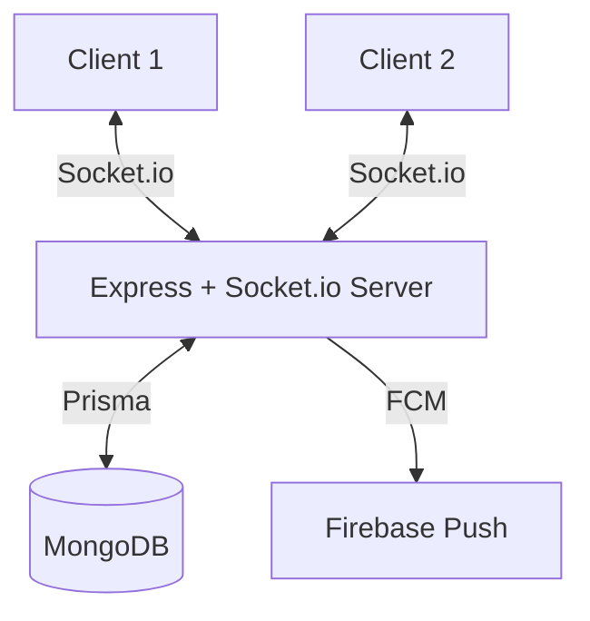

# CricScore — Low-Level Design (Part 2)

> **Scope:** Location, Messaging, Tournament, UI/UX, PWA, Notifications, Social, Code Quality, Public API

---

## 8. Location & Match Invites — Google Maps

### 8.1 Ground Management — Simplified

> **Note:** Keeping ground management simple — no reviews or facilities tracking. Grounds are just location pins with a name, GPS, optional photos, and pitch type.

```prisma
model Ground {
  // ... existing (name, latitude, longitude, address, isFavorite)
  photos        String[]         // NEW: Cloudinary URLs
  pitchType     PitchType?       // NEW
}

enum PitchType {
  TURF
  MAT
  CEMENT
  SYNTHETIC
}
```

> Grounds belong to teams, not players. A team sets their home ground(s), and those are used for invites. Teams can also send invites **without specifying a ground** — the responding team with a ground can offer their venue.

### 8.2 Multiple Saved Locations

```prisma
model UserLocation {
  id         String   @id @default(auto()) @map("_id") @db.ObjectId
  userId     String   @db.ObjectId
  label      String   // "Home", "Office", "Weekend Ground"
  latitude   Float
  longitude  Float
  isDefault  Boolean  @default(false)
  alertRadius Int     @default(10) // km — proximity alerts
  user       User     @relation(fields: [userId], references: [id])
}
```

### 8.3 Match Seeker (Looking for Match)

```prisma
model MatchSeeker {
  id            String    @id @default(auto()) @map("_id") @db.ObjectId
  teamId        String    @db.ObjectId
  preferredDate DateTime?
  preferredTime TimeSlot?
  overs         Int?
  ballType      BallType?
  message       String?
  latitude      Float
  longitude     Float
  radius        Int       @default(15)
  isActive      Boolean   @default(true)
  createdAt     DateTime  @default(now())
  expiresAt     DateTime
  team          Team      @relation(fields: [teamId], references: [id])
}

enum TimeSlot { MORNING  AFTERNOON  EVENING }
enum BallType { STITCH  RED_TENNIS  GREEN_TENNIS  WHITE_TENNIS  CORK }
```

### 8.4 Google Maps Integration
- **Library:** `@react-google-maps/api`
- **Map View:** Full-screen map on Match Invites page tab
  - Green pins = grounds with active invites
  - Gray pins = grounds without invites
  - Blue pin = your location
  - Tap pin → bottom sheet with ground/invite details
- **Cluster pins** when zoomed out (use `@googlemaps/markerclusterer`)

### 8.5 Smart Match Feed
Algorithm scoring for feed ranking:
```
score = (1 / distanceKm) × recencyMultiplier × formatMatch
```
- `recencyMultiplier`: 1.0 (today) → 0.5 (3 days) → 0.1 (7+ days)
- `formatMatch`: 1.5 if preferred overs/ball type matches, 1.0 otherwise

### 8.6 Invite Counter-Proposals

```prisma
model InviteResponse {
  // ... existing fields
  proposedDate      DateTime?      // NEW
  proposedTime      String?        // NEW
  proposedGroundId  String? @db.ObjectId  // NEW
  proposedOvers     Int?           // NEW
  isCounterProposal Boolean @default(false) // NEW
}
```

### 8.7 Invite Templates

```prisma
model InviteTemplate {
  id          String  @id @default(auto()) @map("_id") @db.ObjectId
  teamId      String  @db.ObjectId
  name        String
  groundId    String? @db.ObjectId
  overs       Int
  time        String
  ballType    BallType?
  description String?
  team        Team    @relation(fields: [teamId], references: [id])
}
```

### 8.8 Team Reliability Score

```prisma
model Team {
  // ... existing
  matchesConfirmed  Int  @default(0)
  matchesCancelled  Int  @default(0)
  // reliability = (confirmed - cancelled) / confirmed * 100
}
```
Display: 🟢 95%+ Reliable, 🟡 70-94%, 🔴 <70% + warning badge on invites.

### 8.9 Quick Match
FAB button → select saved ground → auto-fills: today, evening, team's preferred overs → single confirm → posted.

### 8.10 Proximity Alerts
When new invite created:
```
1. Query all UserLocations within invite.ground radius
2. For each matching user, create Notification
3. Send push notification via FCM
```

### 8.11 Post-Match Flow
- Confirmed invite → auto-creates Match record (pre-filled teams, ground, overs)
- Smart reminders: 24h, 2h, 30min before match
- Ground location auto-posted as Google Maps link in invite chat

### 8.12 Zone/Area Grouping
- Reverse geocode ground coords → extract locality → tag
- Filter: "All Areas" → "Adyar (3)" → "T. Nagar (1)"

---

## 9. Messaging — Socket.io Real-Time

### 9.1 WebSocket Architecture



**Events:**
| Client → Server | Server → Client |
|-----------------|-----------------|
| `message:send` | `message:new` |
| `message:read` | `message:read` |
| `typing:start` | `typing:indicator` |
| `typing:stop` | `typing:stop` |
| `reaction:add` | `reaction:update` |
| `poll:vote` | `poll:update` |

### 9.2 Full Feature List

#### Cricket-Specific Chat

| Feature | Schema/Logic |
|---------|-------------|
| **Scorecard Cards** | Special `MESSAGE` type `SCORECARD` with `data: { matchSummaryId }` → renders rich card |
| **Availability Polls** | New `ChatPoll` model: question + options + votes. Renders as interactive card |
| **Player Performance Tags** | System auto-posts after match: tagged highlight message |
| **Squad Announcement** | Captain selects XI → system generates formatted `SQUAD_ANNOUNCEMENT` message |
| **Challenge Cards** | Team A → Team B chat: `CHALLENGE` message type with match details |
| **Post-Match MVP Vote** | Special `MVP_VOTE` message: each member taps a player → auto-tallied |

#### WhatsApp-Level Features

| Feature | Implementation |
|---------|---------------|
| **Typing Indicators** | Socket event, debounced 3s timeout |
| **Delivery Status** | Single tick (sent) → Double tick (delivered) → Blue tick (read). Track via `deliveredAt`, `readAt` on Message |
| **Online/Last Seen** | `lastSeenAt` on User, updated on socket connect/disconnect |
| **Reply Threads** | `replyToId` already exists → render quoted message above reply |
| **Message Forwarding** | `forwardedFrom` field on Message → "Forwarded" label |
| **Mute** | `mutedUntil DateTime?` on ConversationMember → skip push notifications |
| **Message Search** | `GET /api/conversations/:id/search?q=text` → MongoDB text search |
| **Media Gallery** | `GET /api/conversations/:id/media` → all IMAGE/AUDIO messages |
| **Link Previews** | Server fetches URL metadata (title, description, image) on message send → stores as `linkPreview Json?` |
| **Unread Jump** | Track `lastReadMessageId` → on open, scroll to first unread + "↓ N new" badge |

#### Smart/Automated

| Feature | Implementation |
|---------|---------------|
| **Bot Messages** | System user posts reminders, weather updates, member join/leave |
| **Weather Bot** | On match day, fetch OpenWeatherMap API by ground GPS → post in chat |
| **Auto-Archive** | Background job: if invite chat inactive > 7 days → `isArchived = true` |
| **@Mentions** | Parse `@username` in message text → create notification for mentioned user |
| **Message Scheduling** | `scheduledAt DateTime?` on Message → background job sends at scheduled time |

#### Admin & Moderation

| Feature | Implementation |
|---------|---------------|
| **Announcement Mode** | `isAnnouncementOnly Boolean` on Conversation → only CAPTAIN/VC can send |
| **Remove from Chat** | Delete ConversationMember → system message "X was removed" |
| **Admin-only toggle** | Captain toggles in chat settings |

#### Customization & Fun

| Feature | Implementation |
|---------|---------------|
| **Chat Wallpapers** | `wallpaper String?` on ConversationMember → per-user per-chat |
| **Team Chat Theme** | Auto-apply team primary color as accent |
| **Sticker Packs** | Pre-made cricket sticker URLs, type `STICKER` in Message |
| **Celebration Animations** | Client-side: detect keywords ("century", "hat-trick") → trigger confetti |
| **Voice Rooms** | WebRTC via Socket.io for live voice (future phase) |

#### Organization

| Feature | Implementation |
|---------|---------------|
| **Chat Labels/Tags** | `labels String[]` on ConversationMember |
| **Starred Messages** | `StarredMessage` model (userId, messageId) |
| **Draft Messages** | localStorage per conversation key |
| **Pin Messages** | `pinnedMessageIds String[]` on Conversation |

### 9.3 New Schema Models

```prisma
model Message {
  // ... existing fields
  type            MessageType  // TEXT, IMAGE, AUDIO, SYSTEM, SCORECARD, POLL, CHALLENGE, SQUAD, STICKER
  deliveredAt     DateTime?    // NEW
  readAt          DateTime?    // NEW
  forwardedFrom   String?      // NEW: original messageId
  linkPreview     Json?        // NEW: {title, description, image, url}
  scheduledAt     DateTime?    // NEW
  mentions        String[]     // NEW: array of userIds
}

model ChatPoll {
  id              String   @id @default(auto()) @map("_id") @db.ObjectId
  conversationId  String   @db.ObjectId
  messageId       String   @db.ObjectId
  question        String
  options         Json     // [{text, votes: [userId]}]
  isAnonymous     Boolean  @default(false)
  expiresAt       DateTime?
  createdAt       DateTime @default(now())
}

model StarredMessage {
  id        String   @id @default(auto()) @map("_id") @db.ObjectId
  userId    String   @db.ObjectId
  messageId String   @db.ObjectId
  createdAt DateTime @default(now())
  @@unique([userId, messageId])
}

model ConversationMember {
  // ... existing
  mutedUntil         DateTime?   // NEW
  wallpaper          String?     // NEW
  labels             String[]    // NEW
  lastReadMessageId  String?     // NEW
}

model Conversation {
  // ... existing
  isAnnouncementOnly Boolean @default(false) // NEW
  pinnedMessageIds   String[] // NEW
  isArchived         Boolean @default(false) // NEW
}
```

---

## 10. Tournament/League System

### 10.1 Schema

```prisma
model Tournament {
  id              String   @id @default(auto()) @map("_id") @db.ObjectId
  name            String
  description     String?
  format          TournamentFormat
  overs           Int
  ballType        BallType?
  maxTeams        Int
  startDate       DateTime
  endDate         DateTime?
  status          TournamentStatus @default(UPCOMING)
  createdById     String   @db.ObjectId
  venueId         String?  @db.ObjectId
  bannerImage     String?
  rules           Json?
  
  groups          TournamentGroup[]
  fixtures        TournamentFixture[]
  standings       TournamentStanding[]
  teams           TournamentTeam[]
  createdBy       User     @relation(fields: [createdById], references: [id])
}

model TournamentTeam {
  id            String   @id @default(auto()) @map("_id") @db.ObjectId
  tournamentId  String   @db.ObjectId
  teamId        String   @db.ObjectId
  groupId       String?  @db.ObjectId
  seedNumber    Int?
  tournament    Tournament @relation(fields: [tournamentId], references: [id])
  team          Team       @relation(fields: [teamId], references: [id])
}

model TournamentGroup {
  id            String   @id @default(auto()) @map("_id") @db.ObjectId
  tournamentId  String   @db.ObjectId
  name          String   // "Group A", "Group B"
  tournament    Tournament @relation(fields: [tournamentId], references: [id])
}

model TournamentFixture {
  id            String   @id @default(auto()) @map("_id") @db.ObjectId
  tournamentId  String   @db.ObjectId
  round         String   // "Group Stage", "Quarter Final", "Semi Final", "Final"
  matchNumber   Int
  homeTeamId    String?  @db.ObjectId
  awayTeamId    String?  @db.ObjectId
  matchSummaryId String? @db.ObjectId
  scheduledDate DateTime?
  groundId      String?  @db.ObjectId
  status        FixtureStatus @default(UPCOMING)
  winnerId      String?  @db.ObjectId
  tournament    Tournament @relation(fields: [tournamentId], references: [id])
}

model TournamentStanding {
  id            String   @id @default(auto()) @map("_id") @db.ObjectId
  tournamentId  String   @db.ObjectId
  groupId       String?  @db.ObjectId
  teamId        String   @db.ObjectId
  played        Int      @default(0)
  won           Int      @default(0)
  lost          Int      @default(0)
  tied          Int      @default(0)
  noResult      Int      @default(0)
  points        Int      @default(0)
  netRunRate    Float    @default(0)
  tournament    Tournament @relation(fields: [tournamentId], references: [id])
}

enum TournamentFormat { LEAGUE  KNOCKOUT  GROUP_KNOCKOUT }
enum TournamentStatus { UPCOMING  REGISTRATION  GROUP_STAGE  KNOCKOUTS  COMPLETED  CANCELLED }
enum FixtureStatus { UPCOMING  LIVE  COMPLETED  CANCELLED  NO_RESULT }
```

### 10.2 Tournament Flow
```
Create Tournament → Set format/rules → Open Registration → Teams join →
  LEAGUE: Round-robin fixtures auto-generated → Play matches → Points table
  KNOCKOUT: Bracket auto-generated → Play matches → Winners advance
  GROUP_KNOCKOUT: Group stage (round-robin) → Top N per group → Knockout bracket
→ Final → Champion declared
```

### 10.3 UI Pages

| Page | Content |
|------|---------|
| Tournament List | Browse/search tournaments, create new |
| Tournament Detail | Info, teams, fixtures, standings, bracket |
| Points Table | Sortable by points, NRR, with qualification lines |
| Bracket View | Visual knockout bracket (use `react-brackets`) |
| Tournament Admin | Manage fixtures, enter results, advance teams |

### 10.4 Auto-Generated Fixtures
```typescript
// Round-robin: n teams → n*(n-1)/2 matches
function generateRoundRobin(teamIds: string[]): Fixture[] { ... }
// Knockout: n teams → bracket with byes if not power of 2
function generateKnockoutBracket(teamIds: string[]): Fixture[] { ... }
```

### 10.5 Net Run Rate Calculation
```
NRR = (Total runs scored / Total overs faced) - (Total runs conceded / Total overs bowled)
```

---

## 11. UI/UX Quality

### 11.1 Onboarding Flow (Post Profile Setup)

> **No player location required.** Ground locations belong to teams, not individual players. A team without a ground can still send invites — a team with a ground can reply and offer their venue.

```
Step 1: "Create or Join a Team" → Create / Join by Code / Skip
Step 2: "Set Your Team's Ground" → Add ground with GPS (optional, can skip)
Step 3: "Your First Match" → Create Match / Find Opponents / Explore
```

Schema: `onboardingComplete Boolean @default(false)` on User

**Invite without ground flow:**
- Team A has no ground → posts invite: "Looking for 20-over match this Saturday"
- Team B with a ground sees the invite → responds: "Come to Marina Ground, 4 PM"
- Team A accepts → match confirmed at Team B's ground

### 11.2 Dark Mode
- CSS variables for all colors via `globals.css`
- Toggle: Settings page + `prefers-color-scheme` as default
- Store preference in `localStorage` + `dark` class on `<html>`

### 11.3 Skeleton Loading
- Reusable `<Skeleton />` component with shimmer animation
- Apply to: Dashboard cards, Team list, Match history, Messages

### 11.4 Empty States
- Each page: illustration + descriptive text + primary action CTA
- Use `generate_image` or SVG illustrations

### 11.5 Page Transitions
- Framer Motion `<AnimatePresence>` wrapping route content
- Fade + slight slide (200ms duration)

### 11.6 Pull-to-Refresh
- Custom touch handler or `react-pull-to-refresh`
- Dashboard, Messages, Match Invites, Teams pages
- Triggers `queryClient.invalidateQueries()`

---

## 12. PWA & Offline

### 12.1 Manifest + Service Worker
- `public/manifest.json` — app name, icons (192/512px), theme color, `display: standalone`
- Service worker: cache static assets, API response caching strategy

### 12.2 Offline Scoring (Critical)
1. Every ball → `localStorage` save (already partially implemented)
2. Failed API calls → queue in `offlineQueue` (IndexedDB)
3. Show "Offline" banner, scoring continues normally
4. On reconnect → replay queue in order → clear
5. Conflict: server timestamp wins

---

## 13. Notification Center

### 13.1 Schema

```prisma
model Notification {
  id        String   @id @default(auto()) @map("_id") @db.ObjectId
  userId    String   @db.ObjectId
  type      NotificationType
  title     String
  body      String
  data      Json?    // {teamId, matchId, conversationId, etc.}
  isRead    Boolean  @default(false)
  createdAt DateTime @default(now())
  user      User     @relation(fields: [userId], references: [id])
}

enum NotificationType {
  TEAM_INVITE
  MATCH_INVITE
  MATCH_REMINDER
  MESSAGE
  MENTION
  PROXIMITY_ALERT
  TOURNAMENT_UPDATE
  ACHIEVEMENT
  SYSTEM
}
```

### 13.2 UI
- Bell icon 🔔 in header with unread badge count
- Dropdown panel grouped by date
- Tap → navigate to relevant page
- "Mark all as read" action

### 13.3 Push Notifications (FCM)
- On app load → request permission → save FCM token to User
- Server sends push via `firebase-admin` SDK on notification creation
- Triggers: team invite, match invite nearby, new message, match reminder

---

## 14. Social Features & Export

### 14.1 Achievements & Badges

```prisma
model Achievement {
  id          String   @id @default(auto()) @map("_id") @db.ObjectId
  userId      String   @db.ObjectId
  type        AchievementType
  unlockedAt  DateTime @default(now())
  matchId     String?  @db.ObjectId
  user        User     @relation(fields: [userId], references: [id])
}

enum AchievementType {
  FIRST_MATCH
  FIRST_FIFTY
  FIRST_CENTURY
  HAT_TRICK
  FIVE_WICKET_HAUL
  TEN_MATCHES
  FIFTY_MATCHES
  HUNDRED_MATCHES
  SIX_MACHINE       // 5+ sixes in a match
  GOLDEN_DUCK        // out for 0 on first ball
  CAPTAIN            // created a team
  TOURNAMENT_WINNER
}
```

### 14.2 Leaderboards
- Endpoint: `GET /api/leaderboard?category=runs&scope=city&city=Chennai&limit=10`
- Categories: Runs, Average, Strike Rate, Wickets, Economy, Matches
- Scopes: Global, City, Team
- UI: Tab-based page with rank badges 🥇🥈🥉

### 14.3 Player Comparison Tool
- Select 2 players → radar chart (Recharts) + side-by-side table
- Stats: average, SR, economy, wickets, catches, matches
- Endpoint: `GET /api/stats/compare?p1=X&p2=Y`

### 14.4 Export & Share
- **Image Scorecard:** Canvas API → generate styled image (team logos, scores, MoM, branding)
- **PDF Export:** `jspdf` or `html2canvas` → full scorecard PDF
- **Share:** Native Web Share API (`navigator.share()`) → WhatsApp, Instagram, Twitter
- **Match Link:** Shareable URL `cricscore.app/match/XYZ` (public match view page)

### 14.5 Social Feed
- Follow players/teams
- Activity feed on dashboard: "Vinoth scored 67(42)", "Team A won by 35 runs"
- Like/react to match summaries

---

## 15. Code Quality & Performance

### 15.1 Split `routes.ts`

```
server/routes/
  index.ts           → imports + registers all route files
  authRoutes.ts      → /api/auth/*, /api/profile
  teamRoutes.ts      → /api/teams/*, /api/team-invitations/*
  matchRoutes.ts     → /api/matches/*, /api/local-matches/*, scoring
  inviteRoutes.ts    → /api/match-invites/*, /api/grounds/*
  messageRoutes.ts   → /api/conversations/*, /api/messages/*
  statsRoutes.ts     → /api/stats/*, /api/leaderboard
  tournamentRoutes.ts → /api/tournaments/*
  notificationRoutes.ts → /api/notifications/*
```

### 15.2 Split `storage.ts`
Same domain split: `UserStorage`, `TeamStorage`, `MatchStorage`, etc.

### 15.3 Consistent API Response Format
```typescript
// Success: { success: true, data: { ... } }
// Error: { success: false, error: "Message", code: "ERROR_CODE" }
```

### 15.4 Database Indexing
```prisma
// On BattingPerformance:
@@index([userId])
@@index([inningsId])

// On Message:
@@index([conversationId, createdAt])

// On MatchInvite:
@@index([status, createdAt])

// On Ground:
@@index([latitude, longitude])
```

### 15.5 Rate Limiting
- `express-rate-limit`: 100 req/min/IP general, 10/min for auth endpoints

### 15.6 Fix Duplicate Prisma Client
- `messageService.ts` → use shared `prisma` from `db.ts`

---

## 16. Public API

### 16.1 API Key System

```prisma
model ApiKey {
  id          String   @id @default(auto()) @map("_id") @db.ObjectId
  userId      String   @db.ObjectId
  key         String   @unique  // sha256 hash
  name        String
  permissions String[] // ["read:matches", "read:stats"]
  isActive    Boolean  @default(true)
  createdAt   DateTime @default(now())
  lastUsedAt  DateTime?
  user        User     @relation(fields: [userId], references: [id])
}
```

### 16.2 Public Endpoints
| Endpoint | Description |
|----------|-------------|
| `GET /public/v1/match/:id` | Match summary (public view) |
| `GET /public/v1/player/:id/stats` | Player career stats |
| `GET /public/v1/team/:id` | Team info + stats |
| `GET /public/v1/leaderboard` | Public leaderboard |
| `GET /public/v1/match/:id/live` | Live match state (WebSocket) |

### 16.3 Embeddable Widget
- `<iframe>` or `<script>` embed for live scoreboards
- Customizable theme (team colors, dark/light)
- URL: `cricscore.app/embed/match/XYZ`

---

## Implementation Priority

| Phase | Features | Effort |
|-------|----------|--------|
| **Phase 1** | Clerk Auth via Expo (since this is now PWA/Web), Profile Wizard, Code Quality (split files) | 2-3 weeks |
| **Phase 2** | Match Summary Re-Architecture, Stats 10x | 2-3 weeks |
| **Phase 3** | Live Scoring Engine Refactor + Advanced Features | 3-4 weeks |
| **Phase 4** | Guest Player Redesign, Team Enhancements | 1-2 weeks |
| **Phase 5** | Socket.io Messaging (core features) | 2-3 weeks |
| **Phase 6** | Location + Google Maps + Invite System | 2-3 weeks |
| **Phase 7** | UI/UX Polish (dark mode, skeletons, onboarding) | 1-2 weeks |
| **Phase 8** | PWA + Offline Scoring | 1-2 weeks |
| **Phase 9** | Notifications + Push | 1-2 weeks |
| **Phase 10** | Messaging Advanced (polls, stickers, voice etc.) | 2-3 weeks |
| **Phase 11** | Tournament/League System | 3-4 weeks |
| **Phase 12** | Social Features, Export, Achievements | 2-3 weeks |
| **Phase 13** | Public API + Embeddable Widget | 1-2 weeks |

> **Total estimated effort:** ~25-35 weeks for full implementation
